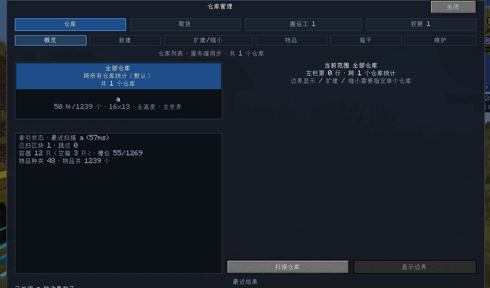
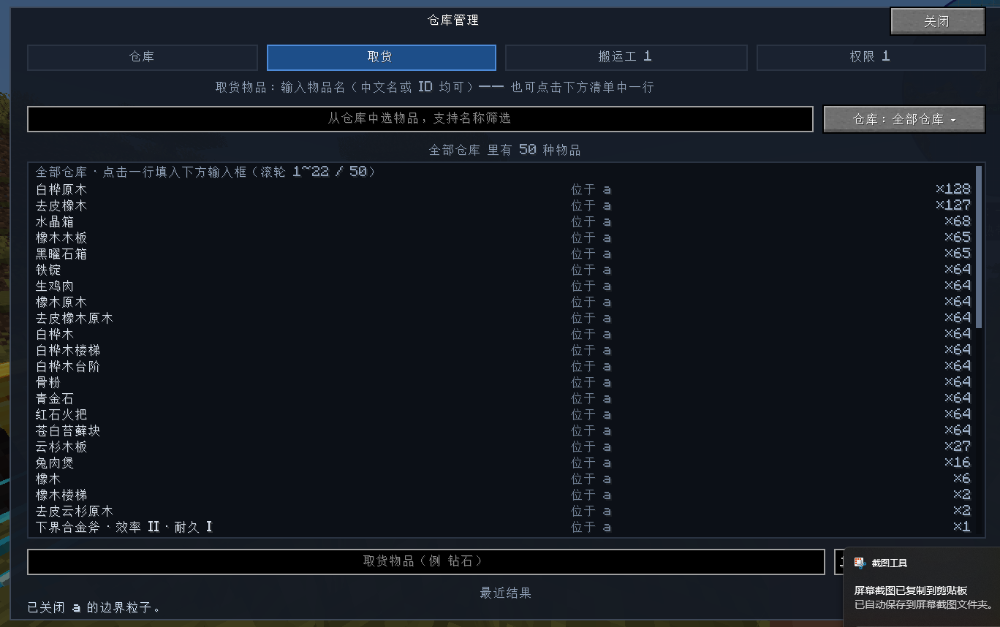
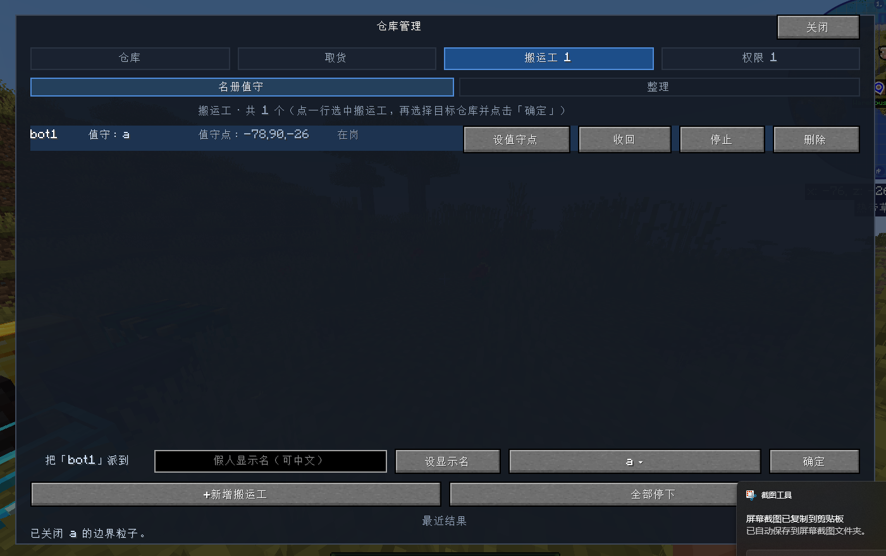
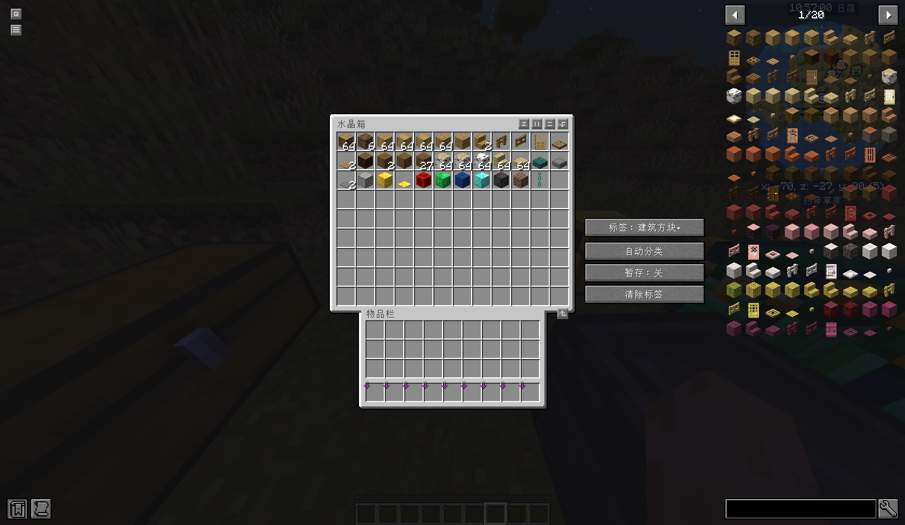

# Warehouse Keeper · 假人仓库管理模组

**声明**

这是一个 100% Vibe Coding 项目，所有代码及代码审查均有 AI 负责，人工负责真机测试。

AI 有可能犯错，仅供 vibe coding 学习用途，请勿用于工业生产以及其他重要行业中。若出现任何损失，后果自负！！！

This is a 100% Vibe Coding project: all coding and code review were done by AI, while humans handled real-device testing.

AI can make mistakes. It is intended for vibe coding and learning purposes only — do not use it in industrial production or any other critical field. Any losses are your own responsibility!!!

## 简介

Warehouse Keeper 是面向 Minecraft 26.2 的 Fabric 模组，用于集中管理基地仓库。模组把若干矩形区域登记为「仓库」，扫描区域内全部容器并建立物品索引，随后在游戏内以可视化面板提供查询、取货、整理与权限管理，并由被称为「搬运工」的假人执行实际的搬运作业。

模组同时提供客户端与服务端内容：联机时服务端负责索引与作业，客户端负责面板与中文物品名；单人游戏下两者同时生效。

## 功能特性

- **仓库登记**：以两个对角点划定矩形区域并保存为仓库，支持扩大、缩小、合并与高度调整；缩小可按方向与格数逐边收缩，也可以一键「缩到我所站位置」（以你脚下的 16×16 区块为准，高度不变）。
- **索引扫描**：一次扫描区域内所有容器（箱子、陷阱箱、木桶、潜影盒，以及 Iron Chests 等任意 `Container` 实现），记录物品 id、数量、所在仓库、坐标与槽位，并额外记录每件物品的附魔与自定义名，支持按附魔或自定义名检索（旧索引需要重新扫描一次才有这些数据）。雕纹书架、26.2 的架子（展示架，12 种木架子）、熔炉、漏斗等非箱子容器照常进索引、可以在面板与网页里查看内容，只是整理时不会把它们当作目标箱、也不会搬动它们。
- **索引持久化**：索引保存在存档目录，进入存档时自动刷新；扫描会临时加载未加载区块，完成后立即释放。
- **游戏内面板**：默认按 `B` 打开，提供概览、物品、箱子、取货、搬运工、权限与审计页面，支持按名称搜索、按分类与数量排序；分类一律显示为中文名（建筑材料、原材料、食物和饮品……），不再是 `minecraft:building_blocks` 这样的原始页签键。物品与箱子里记录的附魔（名称 + 罗马数字等级）与自定义名也会显示在物品清单、物品详情与箱子详情中。
- **搬运工作业**：搬运工可整理仓库、取货并送达指定位置；整理时按箱子标签归类、按容器容量合并堆叠，并在箱内按原版创造栏顺序排序（取不到顺序的物品按名称拼音兜底）；整理完成的报告会分开说明「箱内排序」与「跨箱归类」各多少件。搬运工可另设一个「显示名」，面板内即可设置，面板与网页按显示名展示，指令与身份仍用注册名。
- **容器标签**：可为箱子设置分类标签、自动分类与暂存标记，容器界面显示统一的标签栏；分类键默认是原版创造栏页签，0.20 及更早的中文类目名仍可作为父类使用（贴着旧名的箱子照旧收下辖物品）。归类时优先选择与本物品所属分类**完全同名**的目标箱，其次才是贴旧中文类目名的箱子，父类兜底排在最后 —— 贴了「酿造附魔」的箱子不会再被更近的箱子抢走附魔书。标签栏默认自动选择左/右侧或横向条带，也可在面板「维护」页固定到某一侧（设置存在客户端配置文件里）；标签栏只在真正打开的容器界面上出现，物品栏与创造模式物品栏上不会再残留。
- **权限与审计**：按玩家授予取货、指挥、整理三种权限，管理员（OP）可查看操作日志。

## 游戏实机演示截图










## 运行环境

| 组件 | 版本要求 |
| --- | --- |
| Minecraft | 26.2 |
| Fabric Loader | 0.19.3 或更高 |
| Fabric API | 0.157.0+26.2（或兼容版本） |
| Java | 25 或更高 |
| Carpet（可选） | 26.2，用于生成可见的人形搬运工 |

## 安装

1. 安装 Fabric Loader 0.19.3 或更高版本，并准备 Minecraft 26.2 客户端或服务端。
2. 将 Fabric API 与 `warehouse-keeper-1.0.0.jar` 放入游戏实例的 `mods/` 目录。
3. 联机使用时，服务端与客户端均需安装本模组。
4. 可选：安装 Carpet 以显示人形搬运工。未安装时搬运工不可见，取货与整理功能不受影响。

## 快速开始

1. `/warehouse pos1` 与 `/warehouse pos2` 选择仓库的两个对角点，执行 `/warehouse region save <名称>` 保存仓库。
2. 执行 `/warehouse scan <仓库>` 建立索引，`/warehouse status` 查看扫描进度。
3. 按 `B` 打开面板，在「物品」页查看库存总览。
4. `/warehouse porter add <名称>` 创建搬运工，`/warehouse porter assign <名称> <仓库>` 指定值守仓库。
5. `/warehouse tidy <仓库>` 让搬运工整理仓库；`/warehouse order <物品> [数量]` 下单取货并由搬运工送达。
6. `/warehouse user perm <玩家> take|bot|tidy on|off` 授予其他玩家对应权限。

## 命令参考

全部指令以 `/warehouse` 开头，不带参数的子命令会输出各自的用法提示。

| 分组 | 子命令 |
| --- | --- |
| 仓库 | `pos1`、`pos2`、`region save/list/info/remove`、`region grow/shrink/merge/height` |
| 索引 | `scan`、`status`、`list`、`find`、`enchants [find <附魔或自定义名>]`、`stats`、`save`、`load`、`clear`、`settings`、`categories` |
| 搬运工 | `porter` / `bot`：`add`、`remove`、`assign`、`here`、`spot`、`spawn`、`kill`、`tidy`、`stop`、`display` |
| 取货与入库 | `order`、`give [all]`、`tidy` |
| 标签 | `tag show/list/set/auto/staging/clear/mode/prune` |
| 权限 | `user list/perm/log/migrate` |

修改性命令仅限管理员（OP）执行。普通玩家可用 `status`、`list`、`find`、`enchants`、`stats`、`porter`（只读部分）与 `tag show/list`；`order`、`give` 需要「取货」权限，`tag` 的修改类子命令需要「整理」权限，二者均以管理员（OP）身份执行时不受限制。

## 游戏内面板

按默认按键 `B`（可在「选项 → 控制」中修改「打开仓库管理界面」）打开面板。

- **仓库**页：概览、新建、扩建/缩小、物品、箱子、维护；非管理员仅显示概览、物品与箱子。扩建/缩小按方向与格数调整，也有「扩到/缩到我所站位置」与操作前的二次确认；「维护」页可查看仓库边界显示、切换容器标签栏的停靠位置。
- **取货**页：输入物品名称（支持中文名与物品 id）或点击清单中的一行下单。清单按**附魔分行**列出（例如「附魔书 · 锋利 V ×2」「附魔书 · 保护 III ×3」），可用附魔的注册名（`sharpness`）或中文译名（锋利）搜索；点某一行即精确到该附魔下单，搬运工只会取走附魔匹配的那一格。
- **搬运工**页：名册值守与整理；可新增、指派、收回、停止与删除搬运工，也可在分配行里直接输入并设置只用于展示的显示名（留空即清除）。
- **箱子**页：可按附魔或自定义名搜索（结果输出到聊天栏）。
- **列表滚动**：凡是会溢出的清单，右缘都有一条可拖滑块（按住拖动、点轨道跳转），也可以直接用鼠标滚轮；滑块只在内容真的超出一屏时才出现，不溢出时行与文字按满宽排，不会白留一条空槽。
- **权限**页：权限与审计；按玩家切换取货、指挥、整理三种权限，并查看操作日志。

## 数据与存档

模组不直接改写存档数据，运行期产生的文件均位于游戏实例的配置目录：

```
config/warehouse-keeper/
├── settings.json          模组设置
├── categories.json        物品分类覆盖表（值为创造栏页签键，或作父类用的旧中文类目名）
├── players.json           玩家权限表
├── audit.log              操作日志（超过上限后轮转为 audit.log.1）
└── worlds/<存档名>/
    ├── index.json         仓库索引
    └── container-tags.json 容器标签
config/warehouse-keeper-client.json  客户端设置（容器标签栏的停靠位置等）
```

整理、取货与投递均由搬运工以正常容器交互完成，效果等同于玩家手动操作。

## 从源码构建

编译目标为 Java 25，请将 `JAVA_HOME` 指向 JDK 25（含 `javac`），或通过 `-Dorg.gradle.java.home=<JDK 25 路径>` 指定。

```bash
# Windows
set JAVA_HOME=<JDK 25 路径>
gradlew build

# Linux / macOS
export JAVA_HOME=<JDK 25 路径>
./gradlew build
```

构建产物：

- `build/libs/warehouse-keeper-<版本>.jar`：可直接放入 `mods/` 的模组文件。
- `build/libs/warehouse-keeper-<版本>-sources.jar`：源码包。

开发期运行：`gradlew runClient` 与 `gradlew runServer` 会在 `run/` 目录下启动开发实例（该目录已被 `.gitignore` 忽略）。

## 目录结构

```
src/main/java/com/ds/warehouse/
├── WarehouseMod.java      模组入口与服务端 tick 调度
├── index/                 区域扫描、容器与物品索引、索引持久化
├── porter/                搬运工：作业调度、寻路移动与动作表现
├── config/                设置、容器标签、分类规则与存档级存储
├── net/                   服务端与客户端之间的索引快照与查询协议
├── client/                游戏内面板、标签栏与客户端状态
├── command/               /warehouse 指令树与权限校验
└── util/                  权限、名称表、审计与通用工具
src/main/resources/        fabric.mod.json 与语言文件
```

## 已知限制

- 扫描进行期间，面板数据按较低频率刷新；扫描结束后恢复即时更新。
- 未安装 Carpet 时搬运工不可见，仅能通过指令与面板观察作业结果。
- 中文物品名依赖客户端向服务端推送名称表；专用服务端在没有客户端连入时，指令输出中的物品名为英文。
- 搬运工的显示名只影响面板与网页：26.2 的玩家实体名字直接取自游戏档案名，头顶名牌、聊天与死亡消息仍是注册名。
- 索引格式自 0.22.0 起记录附魔与自定义名、自 1.0.0 起记录到每一格：更新后旧索引仍然可用，但要对相关仓库执行一次 `/warehouse scan <仓库>`，按附魔/自定义名检索以及物品行尾的附魔显示才会有数据（面板与指令都会提示）。
- 附魔名称按客户端语言文件的翻译键显示，模组新增的附魔若缺少语言键，会退回显示英文注册名。
- 面板布局面向 720P 及以上分辨率设计，极窄窗口下部分区域会按可用空间降级或隐藏；自绘列表在布局时会做「文字块不越下一行」的自检，一旦越界会在日志里打出 `行块自检` 警告。
- 容器界面标签栏的形态（左/右竖栏或上/下横条）会随窗口尺寸与容器尺寸自适应降级；「自动」在界面尺寸为 1 时优先贴左侧、更大时优先贴右侧。

## 版本更新

> 逐条改动见 Git 提交记录；下面是各版本的迭代摘要。

### 1.0.0（当前 · 首个正式版）

> 本版即此前开发中的 0.23.0，发布时定版 **1.0.0**；下面按「问题修复 / 体验优化 / 本轮追加」列出全部改动。

**问题修复（来自 10/2 实机反馈）**

- **标签更换后整理失效**：`_spawn_egg` 归到「其他」时取到 -1 下标越界，整理一启动就中止；改为显式「其他」类目 + 越界保护。
- **面板「分类」下拉显示英文页签键**：类目统一显示中文名，下拉内部拆成「回传键 / 显示名」两列。
- **对准箱子按 E 时标签栏贴到物品栏上**：显式排除物品栏与创造模式物品栏，并每 tick 复核当前容器界面。
- **面板左栏文字重叠**：修正行高恒等式（含第 0 行的两行说明），并新增「行块自检」断言。

**体验优化**

- **非箱子容器不再被整理**：雕纹书架、26.2 架子（展示架）、熔炉、漏斗等照常进索引、照常可查看，整理时既不从里面拿、也不往里面放。
- **附魔与自定义名查看**：索引逐格记录附魔与自定义名（索引格式 3 → 4，旧索引重扫一次即可），物品清单 / 物品详情 / 箱子详情行尾显示「附魔名 + 罗马数字等级」与自定义名。
- **假人显示名内置到面板**：「搬运工」页的分配行可直接设置显示名，面板与网页按显示名展示，指令与身份仍用注册名。
- **箱内排序**：按原版创造栏顺序排序，取不到顺序的物品按名称拼音兜底；整理完成报告分列「箱内排序」与「跨箱归类」件数。

**本轮追加**

- **列表滚动条**：仓库列表、物品列表、物品详情、箱子总览、箱内详情、取货清单、展开的仓库清单，以及搬运工名册 / 权限用户表 / 审计日志共用的行区，右缘都有可拖滑块；滚轮方向与内容方向统一（向下滚 = 看更靠后的内容），滑块只在内容真的溢出时出现。
- **取货页按附魔分行 + 按附魔精确取货**：同一种物品按附魔 / 自定义名拆成多行显示，可用附魔的注册名或中文译名搜索，点行下单会带上附魔组合，搬运工只取走匹配的那一格。
- **展示架（26.2 架子）不再被整理**：修掉「名单里写的是 `minecraft:shelf`，而 26.2 的架子按木头分 id」这条等于没生效的判据，改为覆盖 12 种木架子 + `*_shelf` 后缀兜底。

### 0.22.0

- **容器标签栏可固定停靠**：新增 auto / 右 / 左 / 上 / 下 五种停靠位，记忆在客户端配置里，面板「维护」页可循环切换；auto 在界面尺寸为 1 时优先贴左侧，放不下时按原来的降级链退化。
- **搬运工显示名**：`/warehouse bot display <名字> [昵称]`，身份与所有指令仍用注册名，面板与网页按显示名展示（受 26.2 限制，头顶名牌仍是注册名）。
- **仓库缩容**：`/warehouse region shrink <名字> <方向> <格数>` 与「缩到我所站位置」，面板「扩建/缩小」页带二次确认；缩容后用薄板差集清理索引，越界容器不再残留。
- **边界显示改为按仓库逐个开关**：开哪几个仓库就只显示哪几个，切换时只刷新已开启项。
- **左栏新增合成的「全部仓库」行**：点它只看跨仓库汇总，不再触发边界显示。
- **附魔与自定义名**：容器详情逐槽显示；新增 `/warehouse enchants [list|find <附魔或自定义名>]`（内置 43 条中文附魔别名）；索引新增附魔与自定义名两张表（索引格式 2 → 3，旧索引可用但需重扫一次）。

### 0.21.0

- **部分物品没有分类**：类目键改用原版创造栏页签，原先落进「其他」的刷怪蛋等自然归类；`/warehouse status` 增加「未分类」提示。
- **类目拆分与词元修正**：酿造与附魔不再归为一类，火药不再被归入「容器杂项」；旧中文类目名保留为父类，贴旧名的箱子仍能收下辖物品（世界数据不用动）。
- **箱内排序**改为按原版创造栏顺序，取不到顺序的物品按名称拼音兜底。
- **彻底删除自动拾取**：移除就近拾取与清扫的内核代码和面板「清扫地面」按钮，`/warehouse porter|bot sweep` 保留同名入口并明确提示已停用。
- **容器判定统一**：新增 `index/Containers` 作为唯一实现，可配置排除名单（默认排除雕纹书架与书架）。
- **类目键国际化**：类目键 = 创造栏页签键，新增中英文语言文件，旧中文名与 ASCII 别名继续可用。

### 0.20.2

- **准心指着箱子按 E 打开个人物品栏时，标签栏也冒出来**：容器界面判定加门禁，只对真正的容器界面生效。
- **标签栏闪烁 / 整条消失**：按界面缓存数据持有者、目标锁定加短迟滞、挂回操作幂等、空按钮不参与布局。
- **拆箱后标签变成死标签、原地再放箱子继承旧分类**：拆箱时按「不加载区块」的方式算出拼箱键，新增容器消失清理（删记录 + 清 / 改键标签）。
- **双联箱两半各贴了一种分类**：新增合并规则（暂存 > 手动 > 自动，同档比时间），扫描到拼箱时自动收口。
- **中文仓库名无法创建**：新增名称参数类型（引号或到空白为止），29 处仓库名解析一并替换，客户端也不再剥掉中文。

### 0.20.1

- 低风险快修：索引增量更新、清理死代码、消除轮询里的强制加载、文案修正。

### 0.20.0

- 首个版本：仓库登记、区域扫描与物品索引、索引持久化、游戏内面板、搬运工取货与入库、容器标签、权限与审计。

## 模组兼容性

- [更多箱子 Iron Chests](https://modrinth.com/mod/cyberanner-ironchest)
- [Carpet](https://modrinth.com/mod/carpet)：安装后搬运工以可见人形出现；不装也能正常取货与整理

## 许可证

本项目采用 [MIT](LICENSE) 许可证。
